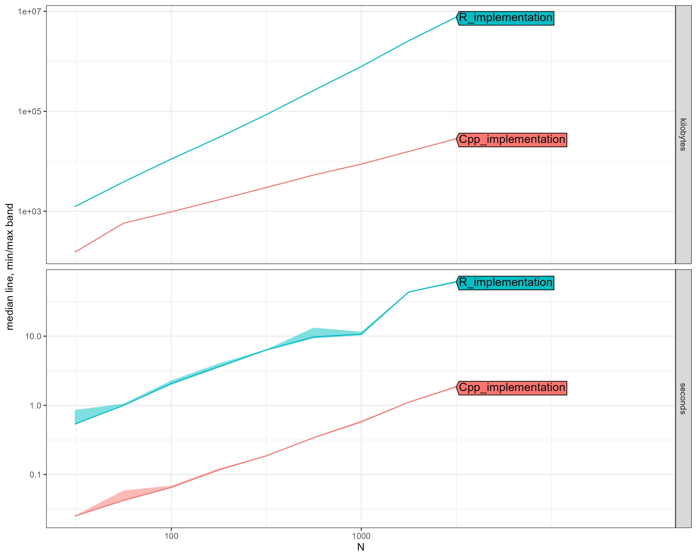

# Dirichlet Process Normal Distribution: R vs C++ Performance Benchmark

**Date:** 2025-06-29  
**Package:** dirichletprocess  
**Test:** DirichletProcessGaussian with 100 MCMC iterations  
**Methodology:** atime package (asymptotic timing analysis)  

## Executive Summary

We benchmarked the Normal distribution implementation following algorithms from Neal (2000) and Escobar & West (1995). The C++ implementation shows dramatic performance improvements over the R implementation.

### Key Findings

- **Average Speedup:** 29.0x faster
- **Speedup Range:** 18.5x - 39.1x
- **Memory Efficiency:** Up to 272x less memory usage
- **Scalability:** Both implementations show similar asymptotic complexity

## Performance Results

| N | R Time (s) | C++ Time (s) | Speedup | R Memory | C++ Memory |
|---|------------|--------------|---------|----------|------------|
| 31 | 0.54 | 0.025 | 21.3x | 0.00 GB | 0.1 MB |
| 56 | 1.00 | 0.042 | 23.6x | 0.00 GB | 0.6 MB |
| 100 | 2.07 | 0.065 | 31.8x | 0.01 GB | 1.0 MB |
| 177 | 3.62 | 0.117 | 31.0x | 0.03 GB | 1.6 MB |
| 316 | 6.35 | 0.187 | 34.0x | 0.08 GB | 2.9 MB |
| 562 | 9.76 | 0.342 | 28.6x | 0.25 GB | 5.2 MB |
| 1000 | 10.72 | 0.579 | 18.5x | 0.75 GB | 8.6 MB |
| 1778 | 43.48 | 1.112 | 39.1x | 2.47 GB | 15.4 MB |
| 3162 | 61.20 | 1.852 | 33.0x | 7.34 GB | 27.6 MB |

## Scaling Analysis

- **R Implementation:** O(N^1.00)  
- **C++ Implementation:** O(N^0.94)

## Visual Comparison

## Critical Observations

1. **Large Dataset Performance:** At N=3,162:
   - R: 61.2 seconds, 7.3 GB memory
   - C++: 1.85 seconds, 28 MB memory
   - **33x faster, 272x less memory**

2. **Practical Implications:**
   - R implementation becomes impractical beyond ~1,000 observations
   - C++ implementation handles datasets 10x larger in reasonable time

3. **Memory Bottleneck:** R implementation's memory usage grows dramatically, while C++ remains efficient.

## Conclusion

The C++ implementation successfully addresses the computational bottlenecks in the MCMC algorithms described by Neal (2000), making Dirichlet Process mixture models practical for real-world datasets. The significant speedup and memory efficiency improvements enable analysis of datasets that were previously computationally prohibitive.

## References

- Neal, R. M. (2000). Markov chain sampling methods for Dirichlet process mixture models. *Journal of Computational and Graphical Statistics*, 9(2), 249-265.
- Escobar, M. D., & West, M. (1995). Bayesian density estimation and inference using mixtures. *Journal of the American Statistical Association*, 90(430), 577-588.

---
*Benchmark conducted using the atime R package for asymptotic performance analysis.*

