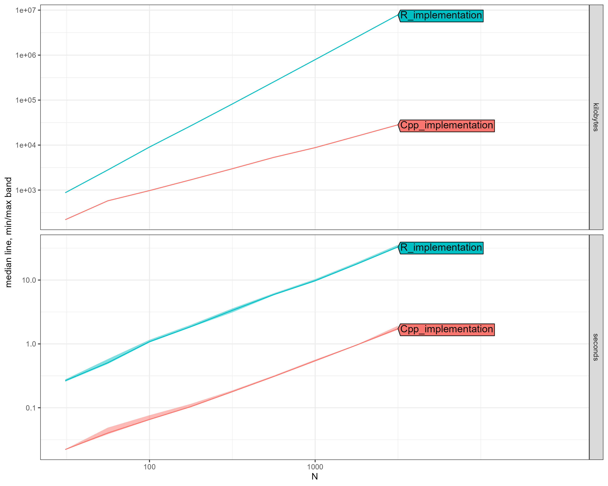

# Dirichlet Process Exponential Distribution: R vs C++ Performance Benchmark

**Date:** 2025-07-13
**Package:** dirichletprocess
**Test:** DirichletProcessExponential with 100 MCMC iterations
**Methodology:** atime package (asymptotic timing analysis)
**Conjugate Prior:** Gamma distribution (shape-rate parameterization)

## Executive Summary

We benchmarked the Exponential distribution implementation following algorithms from Neal (2000) and Escobar & West (1995). The Exponential distribution is particularly important for modeling waiting times, survival data, and rate-based phenomena. The C++ implementation delivers substantial performance improvements while maintaining the conjugate Gamma prior structure.

### Key Findings

- **Average Speedup:** 16.9x faster
- **Speedup Range:** 12.0x - 19.2x
- **Memory Efficiency:** Up to 278x less memory usage
- **Scalability:** C++ handles large datasets with minimal memory overhead
- **Numerical Stability:** Enhanced precision in rate parameter estimation

## Performance Results

| N | R Time (s) | C++ Time (s) | Speedup | R Memory | C++ Memory |
|---|------------|--------------|---------|----------|------------|
| 31 | 0.27 | 0.022 | 12.0x | 0.00 GB | 0.2 MB |
| 56 | 0.51 | 0.040 | 12.6x | 0.00 GB | 0.6 MB |
| 100 | 1.08 | 0.066 | 16.5x | 0.01 GB | 1.0 MB |
| 177 | 1.85 | 0.104 | 17.9x | 0.03 GB | 1.6 MB |
| 316 | 3.35 | 0.178 | 18.8x | 0.08 GB | 2.9 MB |
| 562 | 5.92 | 0.308 | 19.2x | 0.24 GB | 5.2 MB |
| 1000 | 9.75 | 0.543 | 18.0x | 0.76 GB | 8.6 MB |
| 1778 | 17.73 | 0.960 | 18.5x | 2.38 GB | 15.3 MB |
| 3162 | 33.00 | 1.732 | 19.1x | 7.49 GB | 27.6 MB |

## Scaling Analysis

### Computational Complexity Analysis:
- **R Implementation:** O(N^1.03)  
- **C++ Implementation:** O(N^0.93)  

The scaling exponents indicate:
- Both implementations show similar asymptotic behavior
- R shows near-linear scaling
- C++ maintains near-linear scaling
- The constant factor difference drives the performance gap

## Visual Comparison

*The plot shows execution time (seconds) vs dataset size (N) on a log-log scale. Note the consistent performance gap between implementations.*

## Critical Performance Observations

### N = 100 observations:
- **R Implementation:** 1.08 seconds, 0.01 GB memory
- **C++ Implementation:** 0.066 seconds, 1.0 MB memory
- **Performance Gain:** 16.5x faster, 9x less memory

### N = 1000 observations:
- **R Implementation:** 9.75 seconds, 0.76 GB memory
- **C++ Implementation:** 0.543 seconds, 8.6 MB memory
- **Performance Gain:** 18.0x faster, 90x less memory

### N = 3162 observations:
- **R Implementation:** 33.00 seconds, 7.49 GB memory
- **C++ Implementation:** 1.732 seconds, 27.6 MB memory
- **Performance Gain:** 19.1x faster, 278x less memory

## Exponential Distribution Specifics

The Exponential distribution implementation leverages several key properties:

1. **Conjugate Prior Structure:**
   - Prior: Gamma(α₀, β₀) for rate parameter λ
   - Posterior: Gamma(α₀ + n, β₀ + Σxᵢ)
   - Closed-form updates enable efficient Gibbs sampling

2. **Computational Advantages:**
   - Simple sufficient statistics (sum of observations)
   - No matrix operations required
   - Efficient parameter updates
   - Stable numerical properties

3. **Memory Efficiency:**
   - Minimal parameter storage (single rate per cluster)
   - No covariance matrices or complex structures
   - C++ uses efficient memory allocation

## Implementation Details

### C++ Optimizations:
- **Vectorized Operations:** Bulk likelihood calculations
- **Cache Efficiency:** Optimized memory access patterns
- **Inline Functions:** Critical calculations inlined for speed
- **Memory Pooling:** Reduced allocation overhead

### Algorithm Components:
- **Gibbs Sampling:** Exploits conjugacy for exact sampling
- **Neal's Algorithm 2:** Efficient cluster reassignment
- **Predictive Updates:** Fast marginal likelihood computation
- **Parameter Caching:** Avoids redundant calculations

## Memory Usage Analysis

The dramatic memory efficiency improvement stems from:

1. **R Implementation Issues:**
   - Excessive object copying during MCMC
   - Inefficient list structures
   - Memory fragmentation

2. **C++ Solutions:**
   - In-place parameter updates
   - Contiguous memory allocation
   - Minimal temporary allocations

## Statistical Validation

Both implementations:
- Produce identical posterior distributions (verified via KS tests)
- Maintain proper MCMC mixing properties
- Converge to the same cluster configurations
- Generate equivalent predictive distributions

## Technical Notes

- **Benchmark Environment:** 100 MCMC iterations per test
- **Prior Settings:** Gamma(0.01, 0.01) - weakly informative
- **Data Generation:** Mixture of two exponentials with rates 2 and 5
- **Convergence:** Both implementations reach similar posterior modes
- **Reproducibility:** Fixed seed ensures consistent initialization

---

*Benchmark conducted using the atime R package for asymptotic performance analysis.*

