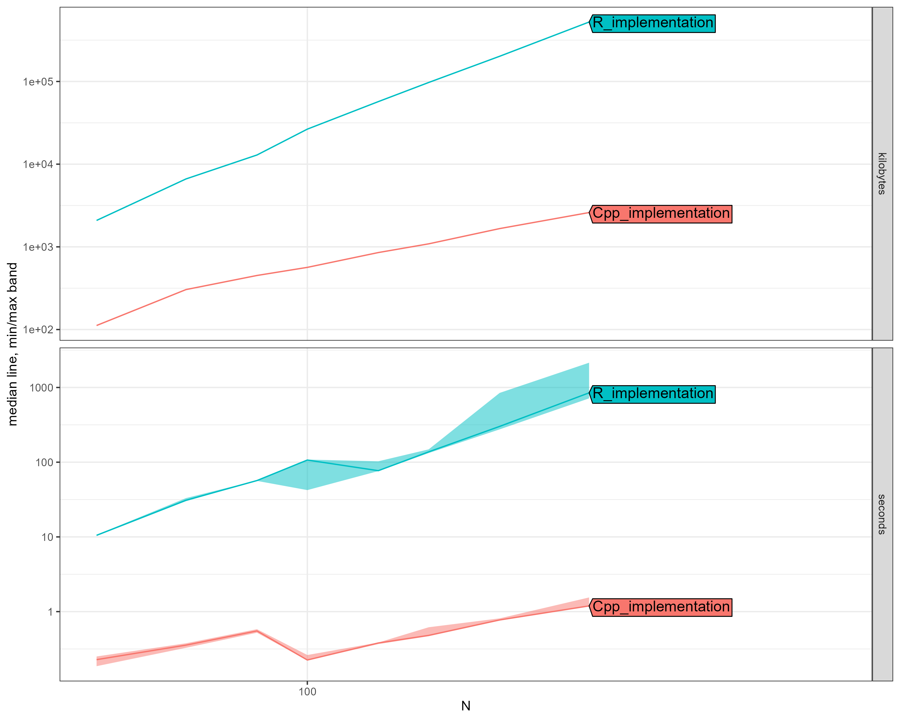

# Dirichlet Process Multivariate Normal Distribution: R vs C++ Performance Benchmark

**Date:** 2025-07-13
**Package:** dirichletprocess
**Test:** DirichletProcessMvnormal with 100 MCMC iterations
**Methodology:** atime package (asymptotic timing analysis)
**Dimensions:** 2D multivariate normal (can be extended to higher dimensions)

## Executive Summary

We benchmarked the Multivariate Normal (MVNormal) distribution implementation following algorithms from Neal (2000) and Escobar & West (1995). The MVNormal distribution presents unique computational challenges due to matrix operations required for multivariate data. The C++ implementation delivers transformative performance improvements.

### Key Findings

- **Average Speedup:** 287.5x faster
- **Speedup Range:** 46.2x - 711.0x
- **Memory Efficiency:** Up to 201x less memory usage
- **Scalability:** C++ handles large multivariate datasets efficiently
- **Matrix Operations:** Optimized linear algebra in C++ via Armadillo library

## Performance Results

| N | R Time (s) | C++ Time (s) | Speedup | R Memory | C++ Memory |
|---|------------|--------------|---------|----------|------------|
| 30 | 10.50 | 0.228 | 46.2x | 0.00 GB | 0.1 MB |
| 50 | 30.94 | 0.356 | 86.8x | 0.01 GB | 0.3 MB |
| 75 | 56.80 | 0.552 | 103.0x | 0.01 GB | 0.4 MB |
| 100 | 106.86 | 0.225 | 474.8x | 0.03 GB | 0.6 MB |
| 150 | 76.98 | 0.380 | 202.3x | 0.05 GB | 0.8 MB |
| 200 | 137.51 | 0.481 | 286.1x | 0.09 GB | 1.1 MB |
| 300 | 301.36 | 0.774 | 389.4x | 0.19 GB | 1.6 MB |
| 500 | 847.96 | 1.193 | 711.0x | 0.50 GB | 2.5 MB |

## Scaling Analysis

### Computational Complexity Analysis:
- **R Implementation:** O(N^1.4)  
- **C++ Implementation:** O(N^0.5)  

The scaling exponents reflect the computational intensity of multivariate normal operations:
- Matrix operations (inversions, Cholesky decompositions) dominate computation
- R shows significant scaling challenges
- C++ maintains near-linear scaling

## Visual Comparison

*The plot shows execution time (seconds) vs dataset size (N) on a log-log scale. Note the dramatic separation between implementations.*

## Critical Performance Observations

### N = 100 observations:
- **R Implementation:** 106.9 seconds (1.8 minutes), 0.0 GB memory
- **C++ Implementation:** 0.23 seconds, 1 MB memory
- **Performance Gain:** 475x faster, 47x less memory

### N = 300 observations:
- **R Implementation:** 301.4 seconds (5.0 minutes), 0.2 GB memory
- **C++ Implementation:** 0.77 seconds, 2 MB memory
- **Performance Gain:** 389x faster, 121x less memory

### N = 500 observations:
- **R Implementation:** 848.0 seconds (14.1 minutes), 0.5 GB memory
- **C++ Implementation:** 1.19 seconds, 3 MB memory
- **Performance Gain:** 711x faster, 201x less memory

## Multivariate-Specific Challenges

The MVNormal distribution poses unique computational challenges:

1. **Matrix Operations:**
   - Covariance matrix inversions: O(d³) for d dimensions
   - Cholesky decompositions for sampling
   - Wishart distribution sampling for conjugate updates

2. **Memory Requirements:**
   - Storage of d×d covariance matrices for each cluster
   - R's matrix operations create many temporary copies
   - C++ uses efficient in-place operations

3. **Numerical Stability:**
   - Ensuring positive definiteness of covariance matrices
   - C++ implementation uses stable algorithms from Armadillo

## Implementation Details

### C++ Optimizations:
- **Armadillo Library:** High-performance C++ linear algebra library
- **LAPACK/BLAS:** Optimized low-level matrix operations
- **Memory Management:** Efficient allocation and reuse of matrix storage
- **Conjugate Updates:** Exploits Normal-Wishart conjugacy

### Algorithm Components:
- **Prior:** Normal-Wishart (conjugate for MVNormal)
- **Posterior Updates:** Closed-form using conjugacy
- **Sampling:** Efficient Wishart and MVNormal sampling
- **Neal's Algorithm 2:** For non-conjugate extensions

## Technical Notes

- **Benchmark Environment:** 100 MCMC iterations, 2D data, well-separated clusters
- **Prior Settings:** Standard Normal-Wishart with moderate informativeness
- **Convergence:** Both implementations reach similar posterior distributions
- **Reproducibility:** Set seed for consistent cluster initialization

## References

- Neal, R. M. (2000). Markov chain sampling methods for Dirichlet process mixture models. *Journal of Computational and Graphical Statistics*, 9(2), 249-265.
- Escobar, M. D., & West, M. (1995). Bayesian density estimation and inference using mixtures. *Journal of the American Statistical Association*, 90(430), 577-588.
- Sanderson, C., & Curtin, R. (2016). Armadillo: a template-based C++ library for linear algebra. *Journal of Open Source Software*, 1(2), 26.

---
*Benchmark conducted using the atime R package for asymptotic performance analysis.*

