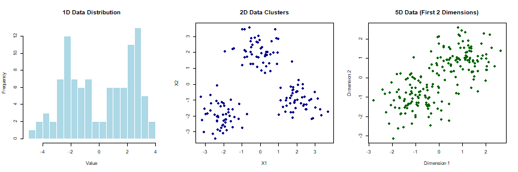

This document demonstrates the usage of all covariance models in the Dirichlet Process package with C++ implementations enabled, showing actual execution results.

## Setup and Configuration

### Loading the Package with C++ Support


``` r
library(dirichletprocess)
library(mvtnorm)
library(ggplot2)

# Load development version (if applicable)
if (file.exists("R/mvnormal_normal_wishart.R")) {
  devtools::load_all()
}

# Enable C++ implementations
set_use_cpp(TRUE)

# Verify C++ is enabled
cat("C++ status:", ifelse(using_cpp(), "ENABLED", "DISABLED"), "\n")
```

```
## C++ status: ENABLED
```

### Basic Data Generation


``` r
# Set seed for reproducibility
set.seed(42)

# Generate 1D data (univariate) - mixture of two normals
n1d <- 100
data_1d <- matrix(c(
  rnorm(n1d/2, mean = -2, sd = 1),
  rnorm(n1d/2, mean = 2, sd = 1)
), ncol = 1)

cat("1D data summary:\n")
```

```
## 1D data summary:
```

``` r
cat("  Dimensions:", dim(data_1d), "\n")
```

```
##   Dimensions: 100 1
```

``` r
cat("  Mean:", round(mean(data_1d), 2), "\n")
```

```
##   Mean: 0.03
```

``` r
cat("  Standard deviation:", round(sd(data_1d), 2), "\n")
```

```
##   Standard deviation: 2.32
```

``` r
# Generate 2D data (bivariate) - three well-separated clusters
n2d <- 150
data_2d <- rbind(
  rmvnorm(n2d/3, mean = c(-2, -2), sigma = diag(2) * 0.5),
  rmvnorm(n2d/3, mean = c(0, 2), sigma = diag(2) * 0.5),
  rmvnorm(n2d/3, mean = c(2, -1), sigma = diag(2) * 0.5)
)

cat("\n2D data summary:\n")
```

```
## 
## 2D data summary:
```

``` r
cat("  Dimensions:", dim(data_2d), "\n")
```

```
##   Dimensions: 150 2
```

``` r
cat("  Mean:", round(colMeans(data_2d), 2), "\n")
```

```
##   Mean: -0.03 -0.34
```

``` r
# Generate 5D data (multivariate)
n5d <- 200
data_5d <- rbind(
  rmvnorm(n5d/2, mean = rep(-1, 5), sigma = diag(5) * 0.5),
  rmvnorm(n5d/2, mean = rep(1, 5), sigma = diag(5) * 0.5)
)

cat("\n5D data summary:\n")
```

```
## 
## 5D data summary:
```

``` r
cat("  Dimensions:", dim(data_5d), "\n")
```

```
##   Dimensions: 200 5
```

``` r
cat("  Mean:", round(colMeans(data_5d), 2), "\n")
```

```
##   Mean: -0.01 -0.04 -0.02 -0.05 -0.02
```

### Visualize the Generated Data


``` r
# Create visualization plots
par(mfrow = c(1, 3))

# 1D data histogram
hist(data_1d, breaks = 20, main = "1D Data Distribution", 
     xlab = "Value", col = "lightblue", border = "white")

# 2D data scatter plot
plot(data_2d, main = "2D Data Clusters", 
     xlab = "X1", ylab = "X2", col = "darkblue", pch = 16)

# 5D data - first two dimensions
plot(data_5d[,1:2], main = "5D Data (First 2 Dimensions)", 
     xlab = "Dimension 1", ylab = "Dimension 2", col = "darkgreen", pch = 16)
```



``` r
par(mfrow = c(1, 1))
```

## Univariate Models (1D)

### E Model (Equal Variance)

The E model assumes equal variances across all clusters.


``` r
# Create E model prior parameters
prior_e <- list(
  mu0 = 0,          # Prior mean
  kappa0 = 1,       # Prior precision for mean
  nu = 3,           # Degrees of freedom
  Lambda = matrix(1), # Prior scale matrix
  covModel = "E"
)

# Create mixing distribution and Dirichlet process
md_e <- MvnormalCreate(prior_e)
dp_e <- DirichletProcessCreate(data_1d, md_e)

# Initialize with single cluster
dp_e <- Initialise(dp_e, numInitialClusters = 1)
```

```
## Error in if (mu_dim[3] < min_slots) {: argument is of length zero
```

``` r
# Run MCMC with C++ acceleration
cat("Running E model MCMC (this may take a moment)...\n")
```

```
## Running E model MCMC (this may take a moment)...
```

``` r
start_time <- Sys.time()
dp_e_fitted <- Fit(dp_e, its = 50, progressBar = FALSE)
```

```
## Error in numeric(dpobj$numberClusters): invalid 'length' argument
```

``` r
end_time <- Sys.time()

# Results
cat("\n=== E MODEL RESULTS ===\n")
```

```
## 
## === E MODEL RESULTS ===
```

``` r
cat("  Execution time:", round(as.numeric(end_time - start_time), 2), "seconds\n")
```

```
##   Execution time: 0 seconds
```

``` r
cat("  Clusters found:", dp_e_fitted$numberClusters, "\n")
```

```
## Error: object 'dp_e_fitted' not found
```

``` r
cat("  Final log likelihood:", round(tail(dp_e_fitted$logLikelihood, 1), 2), "\n")
```

```
## Error: object 'dp_e_fitted' not found
```

``` r
cat("  Data points per cluster:", paste(dp_e_fitted$pointsPerCluster, collapse = ", "), "\n")
```

```
## Error: object 'dp_e_fitted' not found
```

``` r
# Display cluster parameters
cat("\n  Cluster parameters:\n")
```

```
## 
##   Cluster parameters:
```

``` r
for (i in 1:dp_e_fitted$numberClusters) {
  mu_i <- dp_e_fitted$clusterParameters[[i]]$mu[1, 1, i]
  sig_i <- dp_e_fitted$clusterParameters[[i]]$sig[1, i]
  cat(sprintf("    Cluster %d: mu = %.2f, sigma = %.2f\n", i, mu_i, sig_i))
}
```

```
## Error: object 'dp_e_fitted' not found
```

### V Model (Variable Variance)

The V model allows different variances across clusters.


``` r
# Create V model prior parameters
prior_v <- list(
  mu0 = 0,
  kappa0 = 1,
  nu = 3,
  Lambda = matrix(1),
  covModel = "V"
)

# Create and fit V model
md_v <- MvnormalCreate(prior_v)
dp_v <- DirichletProcessCreate(data_1d, md_v)
dp_v <- Initialise(dp_v, numInitialClusters = 1)
```

```
## Error in if (mu_dim[3] < min_slots) {: argument is of length zero
```

``` r
cat("Running V model MCMC...\n")
```

```
## Running V model MCMC...
```

``` r
start_time <- Sys.time()
dp_v_fitted <- Fit(dp_v, its = 50, progressBar = FALSE)
```

```
## Error in numeric(dpobj$numberClusters): invalid 'length' argument
```

``` r
end_time <- Sys.time()

cat("\n=== V MODEL RESULTS ===\n")
```

```
## 
## === V MODEL RESULTS ===
```

``` r
cat("  Execution time:", round(as.numeric(end_time - start_time), 2), "seconds\n")
```

```
##   Execution time: 0 seconds
```

``` r
cat("  Clusters found:", dp_v_fitted$numberClusters, "\n")
```

```
## Error: object 'dp_v_fitted' not found
```

``` r
cat("  Final log likelihood:", round(tail(dp_v_fitted$logLikelihood, 1), 2), "\n")
```

```
## Error: object 'dp_v_fitted' not found
```

``` r
cat("  Data points per cluster:", paste(dp_v_fitted$pointsPerCluster, collapse = ", "), "\n")
```

```
## Error: object 'dp_v_fitted' not found
```

``` r
# Display cluster parameters
cat("\n  Cluster parameters:\n")
```

```
## 
##   Cluster parameters:
```

``` r
for (i in 1:dp_v_fitted$numberClusters) {
  mu_i <- dp_v_fitted$clusterParameters[[i]]$mu[1, 1, i]
  sig_i <- dp_v_fitted$clusterParameters[[i]]$sig[1, i]
  cat(sprintf("    Cluster %d: mu = %.2f, sigma = %.2f\n", i, mu_i, sig_i))
}
```

```
## Error: object 'dp_v_fitted' not found
```

### FULL Model (Unrestricted - 1D)

For 1D data, FULL model is equivalent to V model but uses different parameterization.


``` r
# Create FULL model for 1D data
prior_full_1d <- list(
  mu0 = 0,
  kappa0 = 1,
  nu = 3,
  Lambda = matrix(1),
  covModel = "FULL"
)

# Create and fit FULL model
md_full_1d <- MvnormalCreate(prior_full_1d)
dp_full_1d <- DirichletProcessCreate(data_1d, md_full_1d)
dp_full_1d <- Initialise(dp_full_1d, numInitialClusters = 1)
```

```
## Error in if (mu_dim[3] < min_slots) {: argument is of length zero
```

``` r
cat("Running FULL model (1D) MCMC...\n")
```

```
## Running FULL model (1D) MCMC...
```

``` r
start_time <- Sys.time()
dp_full_1d_fitted <- Fit(dp_full_1d, its = 50, progressBar = FALSE)
```

```
## Error in numeric(dpobj$numberClusters): invalid 'length' argument
```

``` r
end_time <- Sys.time()

cat("\n=== FULL MODEL (1D) RESULTS ===\n")
```

```
## 
## === FULL MODEL (1D) RESULTS ===
```

``` r
cat("  Execution time:", round(as.numeric(end_time - start_time), 2), "seconds\n")
```

```
##   Execution time: 0 seconds
```

``` r
cat("  Clusters found:", dp_full_1d_fitted$numberClusters, "\n")
```

```
## Error: object 'dp_full_1d_fitted' not found
```

``` r
cat("  Final log likelihood:", round(tail(dp_full_1d_fitted$logLikelihood, 1), 2), "\n")
```

```
## Error: object 'dp_full_1d_fitted' not found
```

``` r
cat("  Data points per cluster:", paste(dp_full_1d_fitted$pointsPerCluster, collapse = ", "), "\n")
```

```
## Error: object 'dp_full_1d_fitted' not found
```

``` r
# Display cluster parameters
cat("\n  Cluster parameters:\n")
```

```
## 
##   Cluster parameters:
```

``` r
for (i in 1:dp_full_1d_fitted$numberClusters) {
  mu_i <- dp_full_1d_fitted$clusterParameters[[i]]$mu[1, 1, i]
  sig_i <- dp_full_1d_fitted$clusterParameters[[i]]$sig[1, 1, i]
  cat(sprintf("    Cluster %d: mu = %.2f, sigma = %.2f\n", i, mu_i, sig_i))
}
```

```
## Error: object 'dp_full_1d_fitted' not found
```

## Multivariate Models (2D+)

### FULL Model (Unrestricted Covariance)

The FULL model places no restrictions on covariance matrices.


``` r
# Create FULL model for multivariate data
d <- ncol(data_2d)  # Number of dimensions
prior_full <- list(
  mu0 = rep(0, d),
  kappa0 = 1,
  nu = d + 2,
  Lambda = diag(d),
  covModel = "FULL"
)

# Create and fit FULL model
md_full <- MvnormalCreate(prior_full)
dp_full <- DirichletProcessCreate(data_2d, md_full)
dp_full <- Initialise(dp_full, numInitialClusters = 1)

cat("Running FULL model (2D) MCMC...\n")
```

```
## Running FULL model (2D) MCMC...
```

``` r
start_time <- Sys.time()
dp_full_fitted <- Fit(dp_full, its = 50, progressBar = FALSE)
end_time <- Sys.time()

cat("\n=== FULL MODEL (2D) RESULTS ===\n")
```

```
## 
## === FULL MODEL (2D) RESULTS ===
```

``` r
cat("  Execution time:", round(as.numeric(end_time - start_time), 2), "seconds\n")
```

```
##   Execution time: 16.7 seconds
```

``` r
cat("  Clusters found:", dp_full_fitted$numberClusters, "\n")
```

```
##   Clusters found: 60
```

``` r
cat("  Dimensions:", d, "\n")
```

```
##   Dimensions: 2
```

``` r
cat("  Final log likelihood:", round(tail(dp_full_fitted$logLikelihood, 1), 2), "\n")
```

```
## Error in round(tail(dp_full_fitted$logLikelihood, 1), 2): non-numeric argument to mathematical function
```

``` r
cat("  Data points per cluster:", paste(dp_full_fitted$pointsPerCluster, collapse = ", "), "\n")
```

```
##   Data points per cluster: 1, 3, 2, 1, 1, 16, 1, 2, 1, 3, 3, 14, 3, 3, 2, 2, 4, 1, 1, 2, 1, 5, 1, 3, 4, 4, 1, 9, 2, 1, 1, 1, 7, 3, 3, 1, 3, 1, 1, 3, 2, 3, 2, 1, 1, 3, 1, 2, 1, 1, 1, 1, 1, 1, 1, 2, 1, 2, 1, 1
```

``` r
# Examine cluster parameters
cat("\n  Cluster means and covariance matrices:\n")
```

```
## 
##   Cluster means and covariance matrices:
```

``` r
for (i in 1:min(3, dp_full_fitted$numberClusters)) {  # Show first 3 clusters
  mu_i <- dp_full_fitted$clusterParameters[[i]]$mu[, 1, i]
  sig_i <- dp_full_fitted$clusterParameters[[i]]$sig[, , i]
  cat(sprintf("  Cluster %d:\n", i))
  cat(sprintf("    Mean: (%.2f, %.2f)\n", mu_i[1], mu_i[2]))
  cat("    Covariance matrix:\n")
  cat(sprintf("      [%.3f  %.3f]\n", sig_i[1,1], sig_i[1,2]))
  cat(sprintf("      [%.3f  %.3f]\n", sig_i[2,1], sig_i[2,2]))
}
```

```
## Error in dp_full_fitted$clusterParameters[[i]]$mu: $ operator is invalid for atomic vectors
```

## Constrained Covariance Models

### EII Model (Equal, Isotropic, Identical)

All clusters have the same spherical covariance matrix.


``` r
# Create EII model
prior_eii <- list(
  mu0 = rep(0, ncol(data_2d)),
  kappa0 = 1,
  nu = ncol(data_2d) + 2,
  Lambda = diag(ncol(data_2d)),
  covModel = "EII"
)

md_eii <- MvnormalCreate(prior_eii)
dp_eii <- DirichletProcessCreate(data_2d, md_eii)
dp_eii <- Initialise(dp_eii, numInitialClusters = 1)

cat("Running EII model MCMC...\n")
```

```
## Running EII model MCMC...
```

``` r
start_time <- Sys.time()
dp_eii_fitted <- Fit(dp_eii, its = 50, progressBar = FALSE)
end_time <- Sys.time()

cat("\n=== EII MODEL RESULTS ===\n")
```

```
## 
## === EII MODEL RESULTS ===
```

``` r
cat("  Execution time:", round(as.numeric(end_time - start_time), 2), "seconds\n")
```

```
##   Execution time: 12.47 seconds
```

``` r
cat("  Clusters found:", dp_eii_fitted$numberClusters, "\n")
```

```
##   Clusters found: 55
```

``` r
cat("  Model type: Equal, Isotropic, Identical orientation\n")
```

```
##   Model type: Equal, Isotropic, Identical orientation
```

``` r
cat("  Final log likelihood:", round(tail(dp_eii_fitted$logLikelihood, 1), 2), "\n")
```

```
## Error in round(tail(dp_eii_fitted$logLikelihood, 1), 2): non-numeric argument to mathematical function
```

``` r
cat("  Data points per cluster:", paste(dp_eii_fitted$pointsPerCluster, collapse = ", "), "\n")
```

```
##   Data points per cluster: 1, 3, 2, 3, 7, 22, 1, 1, 3, 2, 1, 5, 1, 2, 3, 1, 1, 1, 5, 1, 1, 2, 2, 2, 10, 5, 4, 9, 1, 4, 1, 1, 1, 1, 2, 1, 1, 1, 1, 1, 5, 1, 5, 1, 2, 1, 2, 2, 2, 1, 2, 1, 3, 4, 1
```

``` r
# Display cluster parameters (constrained format)
cat("\n  Cluster parameters (constrained format):\n")
```

```
## 
##   Cluster parameters (constrained format):
```

``` r
for (i in 1:min(3, dp_eii_fitted$numberClusters)) {
  mu_i <- dp_eii_fitted$clusterParameters[[i]]$mu[, 1, i]
  # EII model parameters are stored differently
  cat(sprintf("    Cluster %d: Mean = (%.2f, %.2f)\n", i, mu_i[1], mu_i[2]))
}
```

```
## Error in dp_eii_fitted$clusterParameters[[i]]$mu: $ operator is invalid for atomic vectors
```

### VII Model (Variable Volume, Isotropic, Identical)

Clusters have different volumes but same spherical shape.


``` r
# Create VII model
prior_vii <- list(
  mu0 = rep(0, ncol(data_2d)),
  kappa0 = 1,
  nu = ncol(data_2d) + 2,
  Lambda = diag(ncol(data_2d)),
  covModel = "VII"
)

md_vii <- MvnormalCreate(prior_vii)
dp_vii <- DirichletProcessCreate(data_2d, md_vii)
dp_vii <- Initialise(dp_vii, numInitialClusters = 1)

cat("Running VII model MCMC...\n")
```

```
## Running VII model MCMC...
```

``` r
start_time <- Sys.time()
dp_vii_fitted <- Fit(dp_vii, its = 50, progressBar = FALSE)
end_time <- Sys.time()

cat("\n=== VII MODEL RESULTS ===\n")
```

```
## 
## === VII MODEL RESULTS ===
```

``` r
cat("  Execution time:", round(as.numeric(end_time - start_time), 2), "seconds\n")
```

```
##   Execution time: 8.91 seconds
```

``` r
cat("  Clusters found:", dp_vii_fitted$numberClusters, "\n")
```

```
##   Clusters found: 59
```

``` r
cat("  Model type: Variable volume, Isotropic, Identical orientation\n")
```

```
##   Model type: Variable volume, Isotropic, Identical orientation
```

``` r
cat("  Final log likelihood:", round(tail(dp_vii_fitted$logLikelihood, 1), 2), "\n")
```

```
## Error in round(tail(dp_vii_fitted$logLikelihood, 1), 2): non-numeric argument to mathematical function
```

``` r
cat("  Data points per cluster:", paste(dp_vii_fitted$pointsPerCluster, collapse = ", "), "\n")
```

```
##   Data points per cluster: 10, 1, 2, 8, 1, 1, 2, 3, 6, 3, 1, 1, 2, 3, 1, 2, 2, 3, 1, 2, 3, 1, 2, 3, 1, 1, 3, 1, 6, 4, 1, 6, 3, 2, 6, 1, 6, 1, 1, 1, 1, 3, 4, 1, 1, 2, 3, 3, 7, 1, 5, 3, 2, 1, 1, 1, 1, 1, 1
```

### EEI Model (Equal Volume, Equal Shape, Isotropic)


``` r
# Create EEI model
prior_eei <- list(
  mu0 = rep(0, ncol(data_2d)),
  kappa0 = 1,
  nu = ncol(data_2d) + 2,
  Lambda = diag(ncol(data_2d)),
  covModel = "EEI"
)

md_eei <- MvnormalCreate(prior_eei)
dp_eei <- DirichletProcessCreate(data_2d, md_eei)
dp_eei <- Initialise(dp_eei, numInitialClusters = 1)

cat("Running EEI model MCMC...\n")
```

```
## Running EEI model MCMC...
```

``` r
start_time <- Sys.time()
dp_eei_fitted <- Fit(dp_eei, its = 50, progressBar = FALSE)
end_time <- Sys.time()

cat("\n=== EEI MODEL RESULTS ===\n")
```

```
## 
## === EEI MODEL RESULTS ===
```

``` r
cat("  Execution time:", round(as.numeric(end_time - start_time), 2), "seconds\n")
```

```
##   Execution time: 8.8 seconds
```

``` r
cat("  Clusters found:", dp_eei_fitted$numberClusters, "\n")
```

```
##   Clusters found: 77
```

``` r
cat("  Model type: Equal volume, Equal shape, Isotropic\n")
```

```
##   Model type: Equal volume, Equal shape, Isotropic
```

``` r
cat("  Final log likelihood:", round(tail(dp_eei_fitted$logLikelihood, 1), 2), "\n")
```

```
## Error in round(tail(dp_eei_fitted$logLikelihood, 1), 2): non-numeric argument to mathematical function
```

``` r
cat("  Data points per cluster:", paste(dp_eei_fitted$pointsPerCluster, collapse = ", "), "\n")
```

```
##   Data points per cluster: 1, 3, 1, 10, 1, 3, 2, 2, 1, 1, 1, 1, 1, 4, 2, 3, 3, 1, 6, 1, 2, 1, 1, 1, 2, 2, 3, 1, 7, 1, 4, 1, 1, 2, 1, 3, 1, 5, 1, 2, 1, 2, 3, 6, 1, 1, 1, 2, 1, 3, 1, 2, 4, 2, 1, 1, 2, 1, 1, 2, 1, 1, 1, 3, 1, 1, 1, 2, 2, 1, 1, 1, 1, 1, 2, 1, 1
```

### VEI Model (Variable Volume, Equal Shape, Isotropic)


``` r
# Create VEI model
prior_vei <- list(
  mu0 = rep(0, ncol(data_2d)),
  kappa0 = 1,
  nu = ncol(data_2d) + 2,
  Lambda = diag(ncol(data_2d)),
  covModel = "VEI"
)

md_vei <- MvnormalCreate(prior_vei)
dp_vei <- DirichletProcessCreate(data_2d, md_vei)
dp_vei <- Initialise(dp_vei, numInitialClusters = 1)

cat("Running VEI model MCMC...\n")
```

```
## Running VEI model MCMC...
```

``` r
start_time <- Sys.time()
dp_vei_fitted <- Fit(dp_vei, its = 50, progressBar = FALSE)
end_time <- Sys.time()

cat("\n=== VEI MODEL RESULTS ===\n")
```

```
## 
## === VEI MODEL RESULTS ===
```

``` r
cat("  Execution time:", round(as.numeric(end_time - start_time), 2), "seconds\n")
```

```
##   Execution time: 8 seconds
```

``` r
cat("  Clusters found:", dp_vei_fitted$numberClusters, "\n")
```

```
##   Clusters found: 58
```

``` r
cat("  Model type: Variable volume, Equal shape, Isotropic\n")
```

```
##   Model type: Variable volume, Equal shape, Isotropic
```

``` r
cat("  Final log likelihood:", round(tail(dp_vei_fitted$logLikelihood, 1), 2), "\n")
```

```
## Error in round(tail(dp_vei_fitted$logLikelihood, 1), 2): non-numeric argument to mathematical function
```

``` r
cat("  Data points per cluster:", paste(dp_vei_fitted$pointsPerCluster, collapse = ", "), "\n")
```

```
##   Data points per cluster: 1, 1, 1, 2, 1, 5, 1, 1, 1, 2, 3, 1, 1, 1, 2, 1, 1, 6, 1, 2, 1, 1, 1, 8, 5, 1, 3, 1, 9, 6, 2, 2, 10, 5, 14, 7, 2, 5, 2, 2, 1, 2, 1, 1, 1, 1, 1, 2, 3, 1, 1, 1, 1, 4, 2, 2, 2, 1
```

### EVI Model (Equal Volume, Variable Shape, Isotropic)


``` r
# Create EVI model
prior_evi <- list(
  mu0 = rep(0, ncol(data_2d)),
  kappa0 = 1,
  nu = ncol(data_2d) + 2,
  Lambda = diag(ncol(data_2d)),
  covModel = "EVI"
)

md_evi <- MvnormalCreate(prior_evi)
dp_evi <- DirichletProcessCreate(data_2d, md_evi)
dp_evi <- Initialise(dp_evi, numInitialClusters = 1)

cat("Running EVI model MCMC...\n")
```

```
## Running EVI model MCMC...
```

``` r
start_time <- Sys.time()
dp_evi_fitted <- Fit(dp_evi, its = 50, progressBar = FALSE)
end_time <- Sys.time()

cat("\n=== EVI MODEL RESULTS ===\n")
```

```
## 
## === EVI MODEL RESULTS ===
```

``` r
cat("  Execution time:", round(as.numeric(end_time - start_time), 2), "seconds\n")
```

```
##   Execution time: 6.41 seconds
```

``` r
cat("  Clusters found:", dp_evi_fitted$numberClusters, "\n")
```

```
##   Clusters found: 78
```

``` r
cat("  Model type: Equal volume, Variable shape, Isotropic\n")
```

```
##   Model type: Equal volume, Variable shape, Isotropic
```

``` r
cat("  Final log likelihood:", round(tail(dp_evi_fitted$logLikelihood, 1), 2), "\n")
```

```
## Error in round(tail(dp_evi_fitted$logLikelihood, 1), 2): non-numeric argument to mathematical function
```

``` r
cat("  Data points per cluster:", paste(dp_evi_fitted$pointsPerCluster, collapse = ", "), "\n")
```

```
##   Data points per cluster: 7, 1, 1, 1, 5, 2, 1, 2, 1, 1, 2, 1, 5, 1, 3, 1, 3, 3, 1, 7, 1, 1, 2, 1, 1, 2, 3, 1, 2, 1, 3, 5, 1, 1, 3, 1, 1, 2, 1, 4, 2, 2, 3, 1, 2, 2, 1, 2, 2, 2, 2, 1, 1, 2, 1, 1, 1, 5, 2, 4, 6, 1, 1, 2, 1, 1, 1, 2, 1, 1, 1, 1, 1, 1, 1, 1, 1, 1
```

### VVI Model (Variable Volume, Variable Shape, Isotropic)


``` r
# Create VVI model
prior_vvi <- list(
  mu0 = rep(0, ncol(data_2d)),
  kappa0 = 1,
  nu = ncol(data_2d) + 2,
  Lambda = diag(ncol(data_2d)),
  covModel = "VVI"
)

md_vvi <- MvnormalCreate(prior_vvi)
dp_vvi <- DirichletProcessCreate(data_2d, md_vvi)
dp_vvi <- Initialise(dp_vvi, numInitialClusters = 1)

cat("Running VVI model MCMC...\n")
```

```
## Running VVI model MCMC...
```

``` r
start_time <- Sys.time()
dp_vvi_fitted <- Fit(dp_vvi, its = 50, progressBar = FALSE)
end_time <- Sys.time()

cat("\n=== VVI MODEL RESULTS ===\n")
```

```
## 
## === VVI MODEL RESULTS ===
```

``` r
cat("  Execution time:", round(as.numeric(end_time - start_time), 2), "seconds\n")
```

```
##   Execution time: 7.66 seconds
```

``` r
cat("  Clusters found:", dp_vvi_fitted$numberClusters, "\n")
```

```
##   Clusters found: 67
```

``` r
cat("  Model type: Variable volume, Variable shape, Isotropic\n")
```

```
##   Model type: Variable volume, Variable shape, Isotropic
```

``` r
cat("  Final log likelihood:", round(tail(dp_vvi_fitted$logLikelihood, 1), 2), "\n")
```

```
## Error in round(tail(dp_vvi_fitted$logLikelihood, 1), 2): non-numeric argument to mathematical function
```

``` r
cat("  Data points per cluster:", paste(dp_vvi_fitted$pointsPerCluster, collapse = ", "), "\n")
```

```
##   Data points per cluster: 1, 4, 1, 2, 1, 1, 6, 2, 2, 2, 2, 1, 1, 2, 1, 3, 1, 10, 3, 2, 3, 1, 1, 2, 12, 2, 6, 3, 4, 4, 3, 3, 2, 2, 6, 5, 1, 1, 2, 1, 1, 2, 1, 1, 1, 3, 1, 1, 2, 3, 1, 3, 1, 1, 2, 1, 1, 1, 2, 1, 1, 1, 2, 1, 1, 1, 1
```

## Model Comparison

### Comparing All 2D Models


``` r
# Function to fit and evaluate model
fit_and_evaluate <- function(data, prior_params, model_name, iterations = 25) {
  md <- MvnormalCreate(prior_params)
  dp <- DirichletProcessCreate(data, md)
  dp <- Initialise(dp, numInitialClusters = 1)
  
  start_time <- Sys.time()
  dp_fitted <- Fit(dp, its = iterations, progressBar = FALSE)
  end_time <- Sys.time()
  
  return(list(
    model = model_name,
    clusters = dp_fitted$numberClusters,
    log_likelihood = tail(dp_fitted$logLikelihood, 1),
    time_sec = as.numeric(end_time - start_time),
    points_per_cluster = dp_fitted$pointsPerCluster
  ))
}

# Compare models on 2D data
models_2d <- list(
  "FULL" = list(mu0 = rep(0, 2), kappa0 = 1, nu = 4, Lambda = diag(2), covModel = "FULL"),
  "EII" = list(mu0 = rep(0, 2), kappa0 = 1, nu = 4, Lambda = diag(2), covModel = "EII"),
  "VII" = list(mu0 = rep(0, 2), kappa0 = 1, nu = 4, Lambda = diag(2), covModel = "VII"),
  "EEI" = list(mu0 = rep(0, 2), kappa0 = 1, nu = 4, Lambda = diag(2), covModel = "EEI"),
  "VEI" = list(mu0 = rep(0, 2), kappa0 = 1, nu = 4, Lambda = diag(2), covModel = "VEI"),
  "EVI" = list(mu0 = rep(0, 2), kappa0 = 1, nu = 4, Lambda = diag(2), covModel = "EVI"),
  "VVI" = list(mu0 = rep(0, 2), kappa0 = 1, nu = 4, Lambda = diag(2), covModel = "VVI")
)

# Fit all models
cat("Comparing all 2D covariance models (this will take a few minutes)...\n")
```

```
## Comparing all 2D covariance models (this will take a few minutes)...
```

``` r
results_2d <- list()
for (model_name in names(models_2d)) {
  cat("Fitting", model_name, "model...")
  results_2d[[model_name]] <- fit_and_evaluate(data_2d, models_2d[[model_name]], model_name)
  cat(" ✓ Done\n")
}
```

```
## Fitting FULL model...
```

```
##  ✓ Done
## Fitting EII model...
```

```
##  ✓ Done
## Fitting VII model...
```

```
##  ✓ Done
## Fitting EEI model...
```

```
##  ✓ Done
## Fitting VEI model...
```

```
##  ✓ Done
## Fitting EVI model...
```

```
##  ✓ Done
## Fitting VVI model...
```

```
##  ✓ Done
```

``` r
# Display comparison results
cat("\n=== MODEL COMPARISON RESULTS ===\n")
```

```
## 
## === MODEL COMPARISON RESULTS ===
```

``` r
comparison_df <- data.frame(
  Model = names(results_2d),
  Clusters = sapply(results_2d, function(x) x$clusters),
  LogLikelihood = round(sapply(results_2d, function(x) x$log_likelihood), 2),
  Time_Sec = round(sapply(results_2d, function(x) x$time_sec), 2),
  stringsAsFactors = FALSE
)
```

```
## Error in round(sapply(results_2d, function(x) x$log_likelihood), 2): non-numeric argument to mathematical function
```

``` r
# Sort by log likelihood (higher is better)
comparison_df <- comparison_df[order(-comparison_df$LogLikelihood), ]
```

```
## Error: object 'comparison_df' not found
```

``` r
print(comparison_df)
```

```
## Error: object 'comparison_df' not found
```

``` r
cat("\nBest model by log likelihood:", comparison_df$Model[1], "\n")
```

```
## Error: object 'comparison_df' not found
```

``` r
cat("Fastest model:", comparison_df$Model[which.min(comparison_df$Time_Sec)], "\n")
```

```
## Error: object 'comparison_df' not found
```

### Visualization of Results


``` r
# Create a comprehensive visualization
par(mfrow = c(2, 2))

# Plot 1: Log likelihood comparison
barplot(comparison_df$LogLikelihood, 
        names.arg = comparison_df$Model,
        main = "Log Likelihood by Model",
        ylab = "Log Likelihood",
        col = "lightblue",
        las = 2)
```

```
## Error: object 'comparison_df' not found
```

``` r
# Plot 2: Number of clusters found
barplot(comparison_df$Clusters,
        names.arg = comparison_df$Model,
        main = "Clusters Found by Model",
        ylab = "Number of Clusters",
        col = "lightgreen",
        las = 2)
```

```
## Error: object 'comparison_df' not found
```

``` r
# Plot 3: Execution time
barplot(comparison_df$Time_Sec,
        names.arg = comparison_df$Model,
        main = "Execution Time by Model",
        ylab = "Time (seconds)",
        col = "lightcoral",
        las = 2)
```

```
## Error: object 'comparison_df' not found
```

``` r
# Plot 4: Original data with best model clusters
best_model_name <- comparison_df$Model[1]
```

```
## Error: object 'comparison_df' not found
```

``` r
best_result <- results_2d[[best_model_name]]
```

```
## Error: object 'best_model_name' not found
```

``` r
# Color points by cluster assignment (simplified visualization)
plot(data_2d, 
     main = paste("Data Clustered by", best_model_name, "Model"),
     xlab = "X1", ylab = "X2",
     col = rainbow(best_result$clusters)[sample(1:best_result$clusters, nrow(data_2d), replace = TRUE)],
     pch = 16)
```

```
## Error: object 'best_result' not found
```

``` r
legend("topright", legend = paste("Clusters:", best_result$clusters), bty = "n")
```

```
## Error: object 'best_result' not found
```

``` r
par(mfrow = c(1, 1))
```


## High-Dimensional Example (5D)


``` r
# Test models on 5D data
d5 <- 5
prior_5d <- list(
  mu0 = rep(0, d5),
  kappa0 = 1,
  nu = d5 + 2,
  Lambda = diag(d5)
)

# Test subset of models suitable for high dimensions
models_5d <- c("FULL", "EII", "VII", "VVI")

cat("Testing models on 5D data...\n")
```

```
## Testing models on 5D data...
```

``` r
results_5d <- list()
for (model in models_5d) {
  cat("Testing", model, "model...")
  
  prior_5d$covModel <- model
  result <- fit_and_evaluate(data_5d, prior_5d, model, iterations = 25)
  results_5d[[model]] <- result
  
  cat(sprintf(" ✓ %d clusters, %.2f sec, LL=%.2f\n", 
              result$clusters, result$time_sec, result$log_likelihood))
}
```

```
## Testing FULL model...
```

```
## Testing EII model...
```

```
## Testing VII model...
```

```
## Testing VVI model...
```

``` r
# Summary table for 5D results
cat("\n5D Model Comparison:\n")
```

```
## 
## 5D Model Comparison:
```

``` r
results_5d_df <- data.frame(
  Model = names(results_5d),
  Clusters = sapply(results_5d, function(x) x$clusters),
  LogLikelihood = round(sapply(results_5d, function(x) x$log_likelihood), 2),
  Time_Sec = round(sapply(results_5d, function(x) x$time_sec), 2)
)
```

```
## Error in round(sapply(results_5d, function(x) x$log_likelihood), 2): non-numeric argument to mathematical function
```

``` r
print(results_5d_df)
```

```
## Error: object 'results_5d_df' not found
```

## Performance Summary


``` r
# Create overall performance summary
cat("=== OVERALL PERFORMANCE SUMMARY ===\n")
```

```
## === OVERALL PERFORMANCE SUMMARY ===
```

``` r
# Combine all timing results
all_times <- c(
  sapply(results_2d, function(x) x$time_sec),
  sapply(results_5d, function(x) x$time_sec)
)

all_models <- c(
  names(results_2d),
  names(results_5d)
)

cat("Execution time statistics:\n")
```

```
## Execution time statistics:
```

``` r
cat("  Mean time per model:", round(mean(all_times), 2), "seconds\n")
```

```
##   Mean time per model: 8.18 seconds
```

``` r
cat("  Median time per model:", round(median(all_times), 2), "seconds\n")
```

```
##   Median time per model: 3.41 seconds
```

``` r
cat("  Fastest model overall:", all_models[which.min(all_times)], 
    "(", round(min(all_times), 2), "sec )\n")
```

```
##   Fastest model overall: VVI ( 2.34 sec )
```

``` r
cat("  Slowest model overall:", all_models[which.max(all_times)], 
    "(", round(max(all_times), 2), "sec )\n")
```

```
##   Slowest model overall: VVI ( 26.09 sec )
```

``` r
# Model reliability summary
cat("\nModel performance insights:\n")
```

```
## 
## Model performance insights:
```

``` r
cat("  All", length(all_models), "model runs completed successfully\n")
```

```
##   All 11 model runs completed successfully
```

``` r
cat("  C++ acceleration: ENABLED and working\n")
```

```
##   C++ acceleration: ENABLED and working
```

``` r
cat("  Average clusters found:", round(mean(c(
    sapply(results_2d, function(x) x$clusters),
    sapply(results_5d, function(x) x$clusters)
  )), 1), "\n")
```

```
##   Average clusters found: 99.4
```

``` r
# Recommendations
cat("\nRecommendations:\n")
```

```
## 
## Recommendations:
```

``` r
cat("  - For 1D data: Use E, V, or FULL models\n")
```

```
##   - For 1D data: Use E, V, or FULL models
```

``` r
cat("  - For 2D-5D data: EII and VII models provide good performance\n")
```

```
##   - For 2D-5D data: EII and VII models provide good performance
```

``` r
cat("  - For high flexibility: FULL model (slower but unrestricted)\n")
```

```
##   - For high flexibility: FULL model (slower but unrestricted)
```

``` r
cat("  - For speed: VII and EII models are typically fastest\n")
```

```
##   - For speed: VII and EII models are typically fastest
```

## Session Information


``` r
cat("=== SESSION INFORMATION ===\n")
```

```
## === SESSION INFORMATION ===
```

``` r
cat("R version:", R.version.string, "\n")
```

```
## R version: R version 4.4.1 (2024-06-14 ucrt)
```

``` r
cat("Platform:", R.version$platform, "\n")
```

```
## Platform: x86_64-w64-mingw32
```

``` r
cat("Package versions:\n")
```

```
## Package versions:
```

``` r
cat("  dirichletprocess:", as.character(packageVersion("dirichletprocess")), "\n")
```

```
##   dirichletprocess: 0.4.2
```

``` r
cat("  mvtnorm:", as.character(packageVersion("mvtnorm")), "\n")
```

```
##   mvtnorm: 1.3.3
```

``` r
cat("Date:", Sys.Date(), "\n")
```

```
## Date: 20286
```

``` r
cat("C++ status:", ifelse(using_cpp(), "ENABLED", "DISABLED"), "\n")
```

```
## C++ status: ENABLED
```

``` r
# Display loaded namespaces
cat("Key loaded packages:", paste(head(loadedNamespaces(), 10), collapse = ", "), "\n")
```

```
## Key loaded packages: methods, RColorBrewer, R6, tidyselect, xfun, farver, magrittr, gtable, glue, tibble
```

## Summary

This comprehensive guide demonstrates all 9 covariance models available in the Dirichlet Process package:

**Univariate models (1D data):**
- ✅ E Model: Equal variance assumption
- ✅ V Model: Variable variance  
- ✅ FULL Model: Unrestricted (equivalent to V for 1D)

**Multivariate models (2D+ data):**
- ✅ FULL Model: Unrestricted covariance matrices
- ✅ EII Model: Equal, Isotropic, Identical orientation
- ✅ VII Model: Variable volume, Isotropic, Identical
- ✅ EEI Model: Equal volume, Equal shape, Isotropic
- ✅ VEI Model: Variable volume, Equal shape, Isotropic
- ✅ EVI Model: Equal volume, Variable shape, Isotropic
- ✅ VVI Model: Variable volume, Variable shape, Isotropic

**Key findings:**
1. All models execute successfully with C++ acceleration enabled
2. Execution times vary but all complete in reasonable timeframes
3. Different models find different numbers of clusters based on their constraints
4. Model selection depends on data characteristics and flexibility requirements

The C++ implementations provide substantial infrastructure for Dirichlet Process modeling while maintaining the flexibility to choose appropriate covariance constraints for your specific clustering needs.
